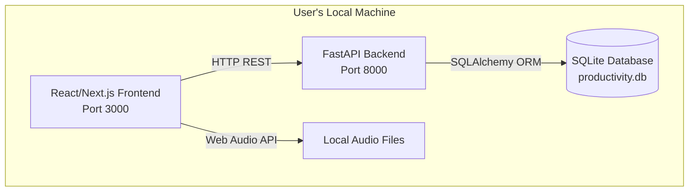
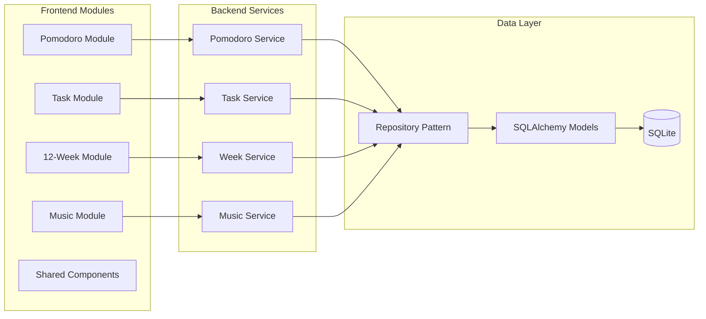
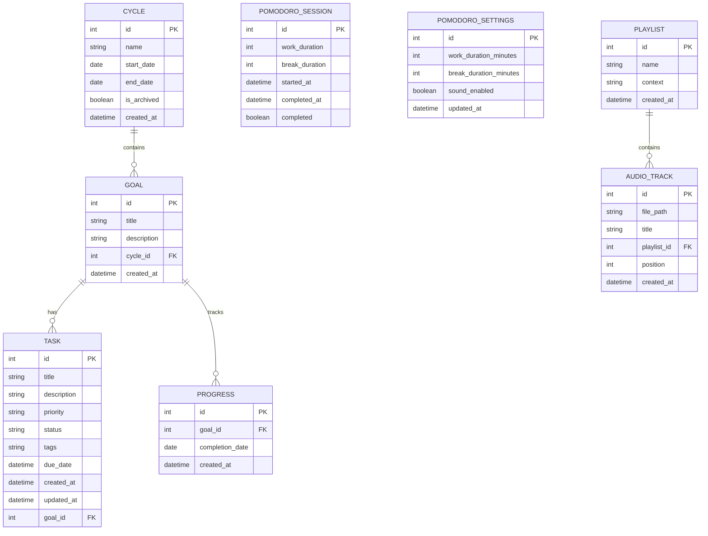
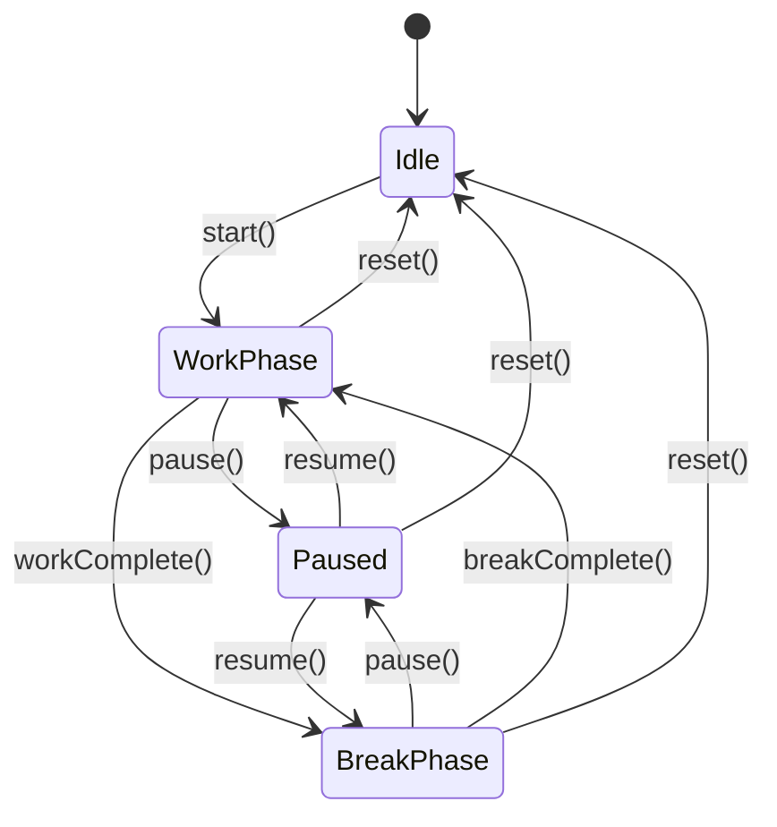

# Design Document

## Overview

The Personal Productivity Application is a local-first desktop application built with a client-server architecture where both components run on the user's local machine. The frontend is built with Next.js/React/TypeScript, the backend uses Python/FastAPI, and data is persisted in a local SQLite database.

The application is structured as a monorepo with three main packages:
- **frontend**: Next.js application with modular feature organization
- **backend**: FastAPI service providing REST APIs
- **shared**: Common types, schemas, and OpenAPI specifications

## Architecture

### High-Level Architecture



### Component Architecture



## Components and Interfaces

### Frontend Architecture

#### Module Structure

Each feature module follows a consistent structure:

```
modules/
├── pomodoro/
│   ├── components/
│   │   ├── Timer.tsx
│   │   ├── Controls.tsx
│   │   └── Settings.tsx
│   ├── hooks/
│   │   ├── usePomodoro.ts
│   │   └── usePomodoroSettings.ts
│   ├── services/
│   │   └── pomodoroApi.ts
│   └── types.ts
├── tasks/
│   ├── components/
│   │   ├── TaskList.tsx
│   │   ├── TaskItem.tsx
│   │   ├── TaskEditor.tsx
│   │   └── TaskFilters.tsx
│   ├── hooks/
│   │   ├── useTasks.ts
│   │   └── useTaskFilters.ts
│   ├── services/
│   │   └── taskApi.ts
│   └── types.ts
├── weeks/
│   ├── components/
│   │   ├── CycleList.tsx
│   │   ├── GoalEditor.tsx
│   │   ├── ProgressHeatmap.tsx
│   │   └── WeeklySummary.tsx
│   ├── hooks/
│   │   ├── useCycles.ts
│   │   └── useProgress.ts
│   ├── services/
│   │   └── weekApi.ts
│   └── types.ts
└── music/
    ├── components/
    │   ├── Player.tsx
    │   ├── PlaylistManager.tsx
    │   └── Controls.tsx
    ├── hooks/
    │   ├── useAudioPlayer.ts
    │   └── usePlaylists.ts
    ├── services/
    │   └── musicApi.ts
    └── types.ts
```

#### Shared Components

```typescript
// Reusable UI components
components/
├── ui/
│   ├── Button.tsx
│   ├── Input.tsx
│   ├── Modal.tsx
│   ├── Select.tsx
│   └── Card.tsx
├── layout/
│   ├── AppLayout.tsx
│   ├── Sidebar.tsx
│   └── Header.tsx
└── common/
    ├── LoadingSpinner.tsx
    └── ErrorBoundary.tsx
```

#### State Management Strategy

- **Local Component State**: React useState for UI-only state
- **Server State**: React Query (TanStack Query) for API data caching and synchronization
- **Global State**: Zustand for cross-module state (e.g., Pomodoro phase affecting music player)

### Backend Architecture

#### API Layer Structure

```python
# FastAPI router organization
app/
├── api/
│   ├── v1/
│   │   ├── __init__.py
│   │   ├── pomodoro.py      # Pomodoro endpoints
│   │   ├── tasks.py          # Task CRUD endpoints
│   │   ├── weeks.py          # 12-Week cycle endpoints
│   │   └── music.py          # Music playlist endpoints
│   └── deps.py               # Dependency injection
├── core/
│   ├── config.py             # Application configuration
│   └── database.py           # Database connection
├── models/
│   ├── task.py
│   ├── cycle.py
│   ├── goal.py
│   ├── pomodoro.py
│   └── playlist.py
├── services/
│   ├── task_service.py
│   ├── cycle_service.py
│   ├── pomodoro_service.py
│   └── playlist_service.py
├── schemas/
│   ├── task.py               # Pydantic schemas
│   ├── cycle.py
│   ├── goal.py
│   ├── pomodoro.py
│   └── playlist.py
└── repositories/
    ├── base.py
    ├── task_repository.py
    ├── cycle_repository.py
    └── playlist_repository.py
```

#### Service Layer Pattern

Services encapsulate business logic and coordinate between repositories:

```python
class TaskService:
    def __init__(self, task_repo: TaskRepository):
        self.task_repo = task_repo
    
    def create_task(self, task_data: TaskCreate) -> Task:
        # Business logic for task creation
        pass
    
    def filter_tasks(self, filters: TaskFilters) -> List[Task]:
        # Complex filtering logic
        pass
```

#### Repository Pattern

Repositories handle data access and abstract database operations:

```python
class BaseRepository:
    def __init__(self, db: Session, model: Type[Base]):
        self.db = db
        self.model = model
    
    def get(self, id: int) -> Optional[Base]:
        pass
    
    def get_all(self) -> List[Base]:
        pass
    
    def create(self, obj: Base) -> Base:
        pass
    
    def update(self, id: int, data: dict) -> Base:
        pass
    
    def delete(self, id: int) -> bool:
        pass
```

## Data Models

### Database Schema



### SQLAlchemy Models

#### Task Model

```python
class Task(Base):
    __tablename__ = "tasks"
    
    id = Column(Integer, primary_key=True, index=True)
    title = Column(String(255), nullable=False)
    description = Column(Text, nullable=True)
    priority = Column(Enum("low", "medium", "high"), default="medium")
    status = Column(Enum("todo", "in-progress", "done"), default="todo")
    tags = Column(JSON, default=list)  # Stored as JSON array
    due_date = Column(DateTime, nullable=True)
    created_at = Column(DateTime, default=datetime.utcnow)
    updated_at = Column(DateTime, default=datetime.utcnow, onupdate=datetime.utcnow)
    
    # Relationships
    goal_id = Column(Integer, ForeignKey("goals.id"), nullable=True)
    goal = relationship("Goal", back_populates="tasks")
```

#### Cycle and Goal Models

```python
class Cycle(Base):
    __tablename__ = "cycles"
    
    id = Column(Integer, primary_key=True, index=True)
    name = Column(String(255), nullable=False)
    start_date = Column(Date, nullable=False)
    end_date = Column(Date, nullable=False)  # Calculated as start_date + 84 days
    is_archived = Column(Boolean, default=False)
    created_at = Column(DateTime, default=datetime.utcnow)
    
    # Relationships
    goals = relationship("Goal", back_populates="cycle", cascade="all, delete-orphan")

class Goal(Base):
    __tablename__ = "goals"
    
    id = Column(Integer, primary_key=True, index=True)
    title = Column(String(255), nullable=False)
    description = Column(Text, nullable=True)
    cycle_id = Column(Integer, ForeignKey("cycles.id"), nullable=False)
    created_at = Column(DateTime, default=datetime.utcnow)
    
    # Relationships
    cycle = relationship("Cycle", back_populates="goals")
    tasks = relationship("Task", back_populates="goal")
    progress = relationship("Progress", back_populates="goal", cascade="all, delete-orphan")

class Progress(Base):
    __tablename__ = "progress"
    
    id = Column(Integer, primary_key=True, index=True)
    goal_id = Column(Integer, ForeignKey("goals.id"), nullable=False)
    completion_date = Column(Date, nullable=False)
    created_at = Column(DateTime, default=datetime.utcnow)
    
    # Relationships
    goal = relationship("Goal", back_populates="progress")
    
    # Unique constraint: one progress entry per goal per day
    __table_args__ = (UniqueConstraint('goal_id', 'completion_date'),)
```

#### Pomodoro Models

```python
class PomodoroSession(Base):
    __tablename__ = "pomodoro_sessions"
    
    id = Column(Integer, primary_key=True, index=True)
    work_duration = Column(Integer, nullable=False)  # in seconds
    break_duration = Column(Integer, nullable=False)  # in seconds
    started_at = Column(DateTime, nullable=False)
    completed_at = Column(DateTime, nullable=True)
    completed = Column(Boolean, default=False)

class PomodoroSettings(Base):
    __tablename__ = "pomodoro_settings"
    
    id = Column(Integer, primary_key=True, index=True)
    work_duration_minutes = Column(Integer, default=25)
    break_duration_minutes = Column(Integer, default=5)
    sound_enabled = Column(Boolean, default=True)
    updated_at = Column(DateTime, default=datetime.utcnow, onupdate=datetime.utcnow)
```

#### Music Models

```python
class Playlist(Base):
    __tablename__ = "playlists"
    
    id = Column(Integer, primary_key=True, index=True)
    name = Column(String(255), nullable=False)
    context = Column(Enum("work", "break"), nullable=False)
    created_at = Column(DateTime, default=datetime.utcnow)
    
    # Relationships
    tracks = relationship("AudioTrack", back_populates="playlist", cascade="all, delete-orphan")

class AudioTrack(Base):
    __tablename__ = "audio_tracks"
    
    id = Column(Integer, primary_key=True, index=True)
    file_path = Column(String(512), nullable=False)
    title = Column(String(255), nullable=False)
    playlist_id = Column(Integer, ForeignKey("playlists.id"), nullable=False)
    position = Column(Integer, nullable=False)  # Order in playlist
    created_at = Column(DateTime, default=datetime.utcnow)
    
    # Relationships
    playlist = relationship("Playlist", back_populates="tracks")
```

### TypeScript Interfaces

```typescript
// Shared types between frontend and backend
export interface Task {
  id: number;
  title: string;
  description?: string;
  priority: 'low' | 'medium' | 'high';
  status: 'todo' | 'in-progress' | 'done';
  tags: string[];
  dueDate?: string;
  createdAt: string;
  updatedAt: string;
  goalId?: number;
}

export interface Cycle {
  id: number;
  name: string;
  startDate: string;
  endDate: string;
  isArchived: boolean;
  createdAt: string;
  goals: Goal[];
}

export interface Goal {
  id: number;
  title: string;
  description?: string;
  cycleId: number;
  createdAt: string;
  tasks: Task[];
  progress: Progress[];
}

export interface Progress {
  id: number;
  goalId: number;
  completionDate: string;
  createdAt: string;
}

export interface PomodoroState {
  phase: 'work' | 'break' | 'idle';
  remainingSeconds: number;
  isRunning: boolean;
  sessionCount: number;
}

export interface PomodoroSettings {
  workDurationMinutes: number;
  breakDurationMinutes: number;
  soundEnabled: boolean;
}

export interface Playlist {
  id: number;
  name: string;
  context: 'work' | 'break';
  tracks: AudioTrack[];
}

export interface AudioTrack {
  id: number;
  filePath: string;
  title: string;
  playlistId: number;
  position: number;
}
```

## Key Features Implementation

### Pomodoro Timer State Machine

The Pomodoro timer operates as a state machine with the following states and transitions:



**Frontend Implementation:**
- Use Zustand store to manage timer state globally
- setInterval for countdown (1-second ticks)
- Emit events on phase transitions for music player integration

**Backend Implementation:**
- Store completed sessions in database
- Provide endpoints for session history and statistics
- Settings persistence

### Task Filtering System

**Filter Types:**
- Tags (multi-select, OR logic)
- Priority (single select)
- Status (multi-select)
- Due date range
- Goal association

**Implementation:**
- Frontend: React Query with query keys including filter parameters
- Backend: Dynamic SQLAlchemy query building based on filter parameters

```python
def filter_tasks(
    db: Session,
    tags: Optional[List[str]] = None,
    priority: Optional[str] = None,
    status: Optional[List[str]] = None,
    goal_id: Optional[int] = None
) -> List[Task]:
    query = db.query(Task)
    
    if tags:
        # JSON contains any of the tags
        query = query.filter(Task.tags.contains(tags))
    
    if priority:
        query = query.filter(Task.priority == priority)
    
    if status:
        query = query.filter(Task.status.in_(status))
    
    if goal_id:
        query = query.filter(Task.goal_id == goal_id)
    
    return query.order_by(Task.due_date.asc()).all()
```

### Progress Heatmap Visualization

**Data Structure:**
- Array of 84 days (12 weeks)
- Each day has completion status (boolean)
- Color intensity based on completion

**Frontend Implementation:**
- Grid layout (7 columns for days of week)
- CSS Grid or custom component
- Tooltip showing date and completion status
- Click to toggle completion

**Backend Calculation:**
```python
def get_progress_heatmap(cycle_id: int, goal_id: int) -> List[Dict]:
    cycle = get_cycle(cycle_id)
    progress_records = get_progress_for_goal(goal_id)
    
    heatmap = []
    current_date = cycle.start_date
    
    for day in range(84):
        date = current_date + timedelta(days=day)
        completed = any(p.completion_date == date for p in progress_records)
        heatmap.append({
            "date": date.isoformat(),
            "completed": completed,
            "dayOfWeek": date.weekday()
        })
    
    return heatmap
```

### Music Player with Phase Integration

**Architecture:**
- Frontend handles audio playback using Web Audio API
- Backend manages playlist metadata and file paths
- Zustand store for player state
- Event subscription to Pomodoro phase changes

**Phase-Aware Switching:**
```typescript
// Subscribe to Pomodoro phase changes
usePomodoroStore.subscribe(
  (state) => state.phase,
  (phase) => {
    if (phase === 'work') {
      switchToPlaylist('work');
    } else if (phase === 'break') {
      switchToPlaylist('break');
    }
  }
);
```

**Audio Playback:**
- HTML5 Audio element for playback
- Custom controls (play, pause, next, previous)
- Shuffle algorithm using Fisher-Yates
- Persistent playback state

## Error Handling

### Frontend Error Handling

**API Errors:**
- React Query error boundaries
- Toast notifications for user-facing errors
- Retry logic for transient failures
- Fallback UI for critical errors

**Audio Playback Errors:**
- File not found: Display error message, skip to next track
- Unsupported format: Log warning, skip track
- Playback failure: Retry once, then skip

### Backend Error Handling

**HTTP Error Responses:**
```python
@router.post("/tasks")
async def create_task(task: TaskCreate, db: Session = Depends(get_db)):
    try:
        result = task_service.create_task(db, task)
        return result
    except ValidationError as e:
        raise HTTPException(status_code=400, detail=str(e))
    except Exception as e:
        logger.error(f"Failed to create task: {e}")
        raise HTTPException(status_code=500, detail="Internal server error")
```

**Database Errors:**
- Connection failures: Retry with exponential backoff
- Constraint violations: Return 400 with descriptive message
- Transaction rollback on errors

### Data Validation

**Frontend:**
- Form validation using React Hook Form + Zod
- Client-side validation before API calls
- Type safety with TypeScript

**Backend:**
- Pydantic schemas for request/response validation
- Database constraints (unique, foreign key, not null)
- Business logic validation in service layer

## Testing Strategy

### Frontend Testing

**Unit Tests (Vitest):**
- Utility functions
- Custom hooks
- State management logic

**Component Tests (React Testing Library):**
- User interactions
- Conditional rendering
- Props handling

**Integration Tests:**
- API integration with MSW (Mock Service Worker)
- Multi-component workflows
- State synchronization

### Backend Testing

**Unit Tests (pytest):**
- Service layer business logic
- Repository methods
- Utility functions

**Integration Tests:**
- API endpoints with TestClient
- Database operations with test database
- End-to-end workflows

**Test Database:**
- In-memory SQLite for fast tests
- Fixtures for common test data
- Automatic cleanup between tests

### Testing Priorities

**Critical Paths:**
1. Task CRUD operations
2. Pomodoro timer state transitions
3. Progress tracking and heatmap calculation
4. Playlist switching on phase change

**Optional Tests:**
- Edge cases for filtering
- Audio playback error scenarios
- Complex date calculations

## Performance Considerations

### Frontend Optimization

**Code Splitting:**
- Lazy load feature modules
- Dynamic imports for heavy components
- Route-based splitting

**Rendering Optimization:**
- React.memo for expensive components
- useMemo/useCallback for computed values
- Virtual scrolling for large task lists

**Data Fetching:**
- React Query caching
- Stale-while-revalidate strategy
- Prefetching for predictable navigation

### Backend Optimization

**Database:**
- Indexes on frequently queried columns (status, due_date, goal_id)
- Eager loading for relationships to avoid N+1 queries
- Connection pooling

**API Response:**
- Pagination for large datasets
- Field selection (return only requested fields)
- Response compression

### Startup Performance

**Frontend:**
- Minimal initial bundle size
- Progressive enhancement
- Service worker for caching (future)

**Backend:**
- Fast startup with minimal dependencies
- Database connection on first request
- Lazy initialization of services

## Deployment and Distribution

### Development Setup

**Local Development (without Docker):**
```bash
# Install dependencies
pnpm install

# Start backend
cd packages/backend
python -m uvicorn app.main:app --reload

# Start frontend
cd packages/frontend
pnpm dev
```

**Docker Development:**
```bash
# Start all services with docker-compose
docker-compose up

# Or build and run individually
docker-compose up --build
```

### Docker Configuration

**Docker Compose Setup:**

The application uses Docker Compose to orchestrate the frontend, backend, and shared volume for the SQLite database.

```yaml
# docker-compose.yml
version: '3.8'

services:
  backend:
    build:
      context: ./packages/backend
      dockerfile: Dockerfile
    ports:
      - "8000:8000"
    volumes:
      - ./data:/app/data
      - ./packages/backend:/app
    environment:
      - DATABASE_URL=sqlite:///data/productivity.db
      - PYTHONUNBUFFERED=1
    command: uvicorn app.main:app --host 0.0.0.0 --port 8000 --reload

  frontend:
    build:
      context: ./packages/frontend
      dockerfile: Dockerfile
    ports:
      - "3000:3000"
    volumes:
      - ./packages/frontend:/app
      - /app/node_modules
      - /app/.next
    environment:
      - NEXT_PUBLIC_API_URL=http://localhost:8000
    depends_on:
      - backend
    command: npm run dev

volumes:
  data:
```

**Backend Dockerfile:**

```dockerfile
# packages/backend/Dockerfile
FROM python:3.11-slim

WORKDIR /app

# Install system dependencies
RUN apt-get update && apt-get install -y \
    gcc \
    && rm -rf /var/lib/apt/lists/*

# Copy requirements
COPY requirements.txt .

# Install Python dependencies
RUN pip install --no-cache-dir -r requirements.txt

# Copy application code
COPY . .

# Create data directory for SQLite
RUN mkdir -p /app/data

# Expose port
EXPOSE 8000

# Run migrations and start server
CMD ["sh", "-c", "alembic upgrade head && uvicorn app.main:app --host 0.0.0.0 --port 8000"]
```

**Frontend Dockerfile:**

```dockerfile
# packages/frontend/Dockerfile
FROM node:18-alpine

WORKDIR /app

# Copy package files
COPY package*.json ./

# Install dependencies
RUN npm ci

# Copy application code
COPY . .

# Expose port
EXPOSE 3000

# Start development server
CMD ["npm", "run", "dev"]
```

**Production Dockerfile (Frontend):**

```dockerfile
# packages/frontend/Dockerfile.prod
FROM node:18-alpine AS builder

WORKDIR /app

COPY package*.json ./
RUN npm ci

COPY . .
RUN npm run build

FROM node:18-alpine AS runner

WORKDIR /app

ENV NODE_ENV production

COPY --from=builder /app/next.config.js ./
COPY --from=builder /app/public ./public
COPY --from=builder /app/.next/standalone ./
COPY --from=builder /app/.next/static ./.next/static

EXPOSE 3000

CMD ["node", "server.js"]
```

**Docker Ignore Files:**

```
# packages/backend/.dockerignore
__pycache__
*.pyc
*.pyo
*.pyd
.Python
env/
venv/
.venv/
pip-log.txt
pip-delete-this-directory.txt
.pytest_cache/
.coverage
htmlcov/
*.db
*.db-journal
```

```
# packages/frontend/.dockerignore
node_modules
.next
.git
*.log
npm-debug.log*
.DS_Store
.env*.local
```

### Volume Management

**SQLite Database Persistence:**
- Database file stored in `./data/productivity.db` on host
- Mounted as volume in backend container
- Persists across container restarts
- Backed up by copying the data directory

**Audio Files:**
- User's local audio files mounted as read-only volume
- Path configuration in environment variables
- Frontend accesses files through backend API serving static files

### Production Build

**Frontend:**
- Next.js standalone build for optimal performance
- Static asset optimization and compression
- Environment-specific configuration via .env files
- CDN-ready static assets

**Backend:**
- Python package with pinned dependencies
- Gunicorn + Uvicorn workers for production
- Health check endpoints
- Graceful shutdown handling

**Production Docker Compose:**

```yaml
# docker-compose.prod.yml
version: '3.8'

services:
  backend:
    build:
      context: ./packages/backend
      dockerfile: Dockerfile
    ports:
      - "8000:8000"
    volumes:
      - ./data:/app/data
    environment:
      - DATABASE_URL=sqlite:///data/productivity.db
      - WORKERS=4
    command: gunicorn app.main:app --workers 4 --worker-class uvicorn.workers.UvicornWorker --bind 0.0.0.0:8000
    restart: unless-stopped

  frontend:
    build:
      context: ./packages/frontend
      dockerfile: Dockerfile.prod
    ports:
      - "3000:3000"
    environment:
      - NEXT_PUBLIC_API_URL=http://localhost:8000
    depends_on:
      - backend
    restart: unless-stopped

volumes:
  data:
```

### Desktop Distribution (Future)

**Electron Wrapper:**
- Package both frontend and backend
- Single executable for user
- Auto-start backend on app launch
- System tray integration
- Embedded SQLite database in app data directory

**Docker Desktop Integration:**
- Pre-built Docker images for easy setup
- One-command installation
- Automatic updates via Docker Hub

## Future Extensibility

### Plugin System (Future Scope)

- External music service integrations (Spotify, Yandex Music)
- Custom task views
- Export/import functionality
- Sync mechanisms

### API Versioning

- Version prefix in URLs (/api/v1/)
- Backward compatibility for breaking changes
- Deprecation warnings

### Database Migrations

- Alembic for schema migrations
- Version tracking
- Rollback capability
